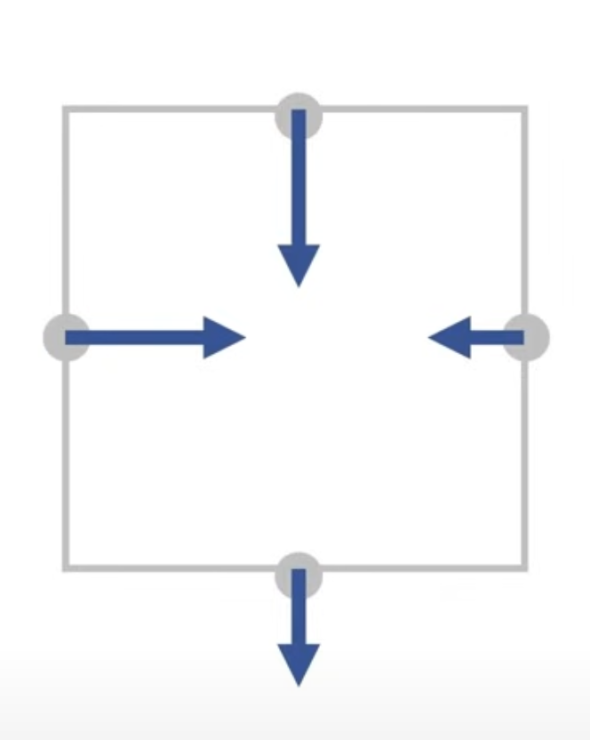
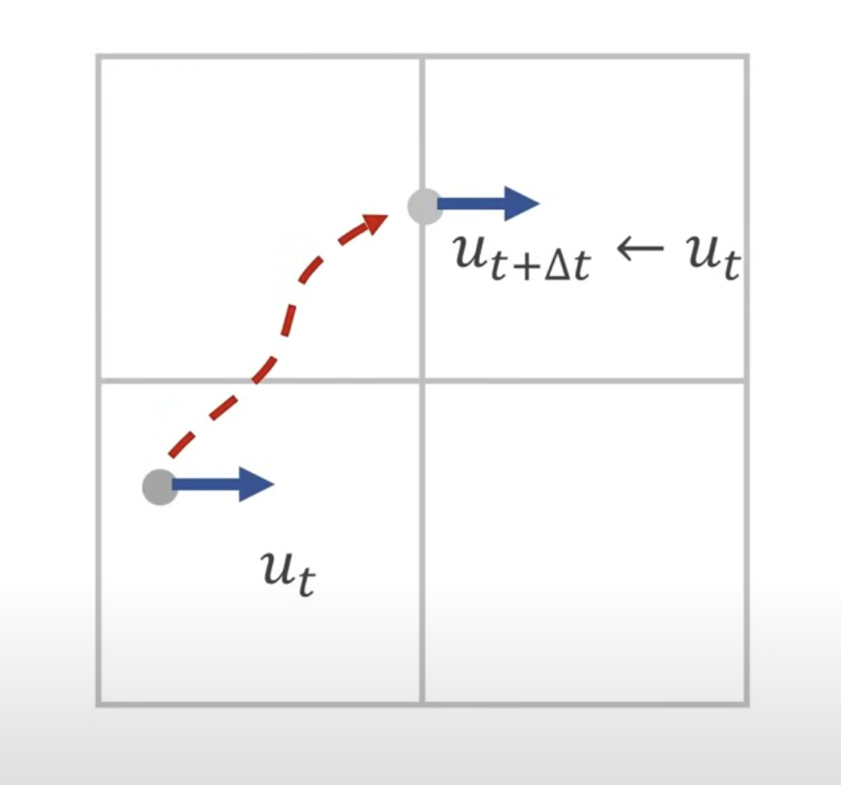
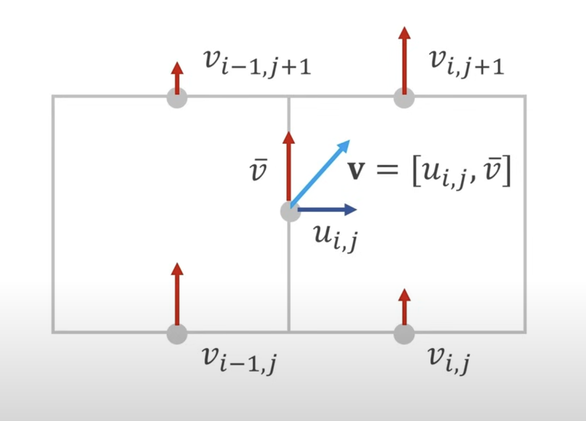
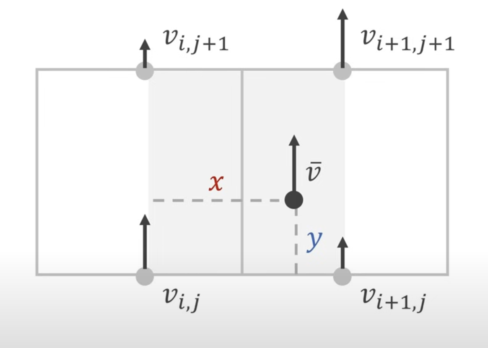

# Eulerian Fluid Simulation

<div align="center">
  
</div>

Simple Fluid Simulation modelling behaviour, pressure,  and velocity in the following:
- Wind Tunnel
- Hires Tunnel 
- Paint
- Tank 
- Smoke 

with the option to model with streamlines. 

## simulation assumptions
Fluid and gases have similar physical structures, and thus, the same simulation method will be used to model both.

The model also assumes incompressibility. Just as a side note, water is very close to being incompressible (10,000 km/cm^3 -> 3% compression). This also acts as a resonable assumption for the behaviour of gases as well.

Zero viscosity, which allows a good approximation for gas and water.


## method

 The simulation uses the Grid Method as introduced by Euler. We essentially model a fluid as a velocity field on a Grid. 

 Velocity will be represented by a 2D vector:  
 
 ```math
 \textbf{v} = \begin{bmatrix} u \\ v \end{bmatrix}$$
 ```


which is represented in a collcated grid. It should be noted that velocity vectors are stored in the center of each grid.


### modifying velocities to model real behaviour (i.e., adding gravity)

To model real behaviour, we need to add gravity. To do so, we do the following:


```sudo
    for all i,j:
     v_i_j = v_i_j + \Delta t \cdot g 
```
where $g$=gravitational constant and $\Delta t$ is the timestep.

### making the fluid incompressible (projection)
To make fluid incompressible, we need to introduce the idea of divergence (i.e., total outflow). Divergence is proportional to the amount of fluid that leaves the cell in a timestep. 

The simulator sums up each vector in the cell. But it needs to be careful for three cases:
- Divergence is positive: too much outflow
- Divergence is negative: too much inflow 
- Divergence is zero: incompressible (desired!)

Note that if all velocity vectors are directed toward the center of the cell, there will be too much inflow.


<p align="center">

</p>

Even if we change one velocity vector, this is not an ideal representation of a fluid since it cannot do that in real life. Therefore, for fluids, all velocities must be pushed by the same amount. Therefore, to make divergence equal to 0, we set:

$$d = u_{i+1, j} - u_{i, j} + v_{i,j+1} - v_{i,j}$$

$$u_{i+1,j}=u_{i+1,j}-\frac{d}{3}$$

$$v_{i,j}=v_{i,j}+\frac{d}{3}$$

$$v_{i,j+1}=v_{i,j+1}-\frac{d}{3}$$

Note for a wall, $u_{i,j}$ is 0. For moving object, or turbine pushing fluid (i.e., wind tunnel), $u_{i,j}$ is not zero.

For a more general case, the simulation stores a scalar value $s$ in each cell, where $s=0$ for walls and obstacles, and $s=1$ for fluid cells. 

$$s=s_{i+1,j} + s_{i-1,j}+s_{i,j+1} + s_{i,j-1}$$

$$u_{i+1,j}=u_{i+1,j}-d\frac{s_{i+1,j}}{s}$$

$$ u_{i,j}=u_{i,j}+d\frac{s_{i-1,j}}{s}$$

$$v_{i,j}=v_{i,j}+d\frac{s_{i,j-1}}{s}$$

$$v_{i,j+1}=v_{i,j+1}-d\frac{s_{i,j+1}}{s}$$

To run across all cells in grid, we loop through each cell. This method is called *Gauss-Seidel Method*. But we must also consider that on the boundary of the grid, we access cells that are outside of the grid. To fix this, the simulator is set to:
- Add border cells
- Set $s_{i,j}=0$ for walls
- Copy neighbouring values that are inside the grid


#### measuring the pressure

To measure the pressure of a fluid, the simulator applies a similar process:
- 1) For each cell in the grid, the pressure is set to $p_{i,j}=0$.
- 2) But for all $n$ iterations (i.e., how many "epochs"), the simulator loops through each cell in the grid, and applies the Gauss-Seidel Method as mentioned above.
- 3) The simulator updates the pressure values as: 

$$ p_{i,j}=p_{i,j}+\frac{d}{s} \cdot \frac{\rho h }{\Delta t} $$

where $p_{i,j}$ is physical pressure, $\rho$ is density, $h$ is grid spacing, and $\Delta t$ is time-step.

#### overrelaxation

The Gauss-Seidel method does require more iterations to converge which may take a very long time. We can boost this spede by using Overrelaxation. 

The simulator multiplies the divergence by a constant $c$ by some scalar 1 < $c$ < 2. However, note that the closer to 2 $c$ is the better. The divergence therefore is:

$$ d = c(u_{i+1,j} - u_{i,j} + v_{i, j+1} - v_{i,j}) $$

### moving the velocity field 
In a fluid, the velocity state is carried by the particles. However, although particles move, grid cells are static, which requires us to move the velocity values on the grid. 

The simulator does this through a method called *Semi-Lagrangian Advection*:


<p align="center">

</p>

The simulator asks itself, which fluid "particle" moved to the location where $u$ is stored. The simulator then sets the new velocity $u_{t+\Delta t}$ to the velocity $u_{t}$ at the previous position. 

To compute the previous location, the simulator follows a series of steps:
- 1) Computes $v$ at position $x$ in the grid where $u$ is stored.
- 2) The previous location can be approximated as $x-\Delta t \cdot v(x)$
- 3) This computation method assumes a straight path that introduces viscosity! However, it can be reduced with vorticity confinement.
- 4) The simulator repeats for all cells in grid.

To get the full 2D velocity, we need to consider an extra dimension of course as indicated below:

<p align="center">

</p>

We essentially just average surrounding horizontal velocities, but a more concise method such as centroid can also be taken into account by weight:

$$v_{avg}=\frac{v_{i,j} + v_{i,j+1} + v_{i-1,j} + v_{i-1,j+1}}{4}$$

Finally, to get the general grid location of $v_{avg}$, the simulator takes a weighted average of the computed average velocity vectors:

<p align="center">

</p>

$$w_{00}=1-\frac{x}{h}$$

$$w_{10}=1-\frac{y}{h}$$

$$w_{01}=\frac{x}{h}$$

$$w_{11}=\frac{y}{h}$$

$$v_{avg}=w_{00}w_{10}v_{i,j}+w_{01}w_{10}v_{i+1,j}+w_{010}w_{11}v_{i, j+1} + w_{011}w_{11}v_{i+1,j+1}$$


### smoke advection

Most data for smoke is already stored in velocity field. 

The extra things that were made include:
 - Store density value at the center of each cell (between 0 and 1 )
 - Advect it like the velocity components as above.

To get the new density value per iteration, the simulation follows a process that includes:
- 1) Use velocity at center of cell
- 2) Draw a line across the grid, and interpolate the location of velocity vector in desired new cell
- 3) That new velocity vector in new cell is the density point

## streamlines

Streamlines were computed as so by continuosly sampling the vector field:

```sudo
x = start position
s = step_size 

for n steps (epochs):
    v = sample vector field V(x)
    x = x + sv
```
